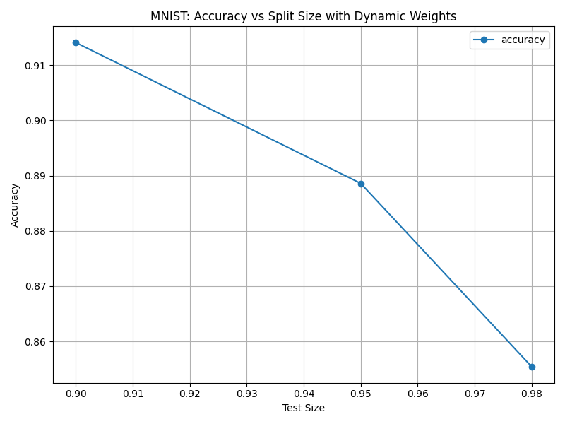

# Group N Comparison

## Methods

Brief description of the methods compared in this study and attribute each method to the respective group member.

1. **Method 1**: Harmonic Minimization Method: The harmonic minizmization method is a graph based learning algorithm for semi-supervised learning. It constructs a graph where each data point is a node, and the edges represent the similarity between them. The algorithm minimizes a cost function that encourages similar points to have similar labels while respecting the known labels, iteratively updating the labels of the unlabeled data points by solivng a harmonic function until convergence.  This method was contributed by Weston Mansier. [Weston's Report](wlm35/Weston_Mansier_Project_Report.md).

2. **Method 2**: Brief description of Method 2. This method was contributed by [Group Member 2 Name]. You can find more details in their individual report: [link to individual report 2].
3. **Method 3**: Brief description of Method 3. This method was contributed by [Group Member 3 Name]. You can find more details in their individual report: [link to individual report 3].

## Results, Analysis, and Discussion

### Experiments

Summarize the experiments conducted by the group, including the datasets and methodology used.

- **Dataset**: Provide details on the dataset(s) used for the comparison, including size, structure, and any relevant features.
- **Methodology**: Describe the experimental setup, including the evaluation metrics, hyperparameters, and any important steps followed during the experiments.

### Results

Present the results of the experiments. Include tables, figures, or graphs to make the data more accessible. Ensure that the results are clearly labeled and explained.

- **Results for Method 1**: Provide the outcome of experiments conducted using Method 1.
- **Results for Method 2**: Provide the outcome of experiments conducted using Method 2.
- **Results for Method 3**: Provide the outcome of experiments conducted using Method 3.

### Analysis and Discussion

Interpret the results and compare the performance of each method.

- **Best Performing Methods**: Which methods performed the best overall? Describe why these methods performed well in the given context.
- **Research Extensions**: Discuss how extensions or variations of the methods worked. Which adaptations were successful, and why?
- **Key Insights**: Summarize what the group learned from comparing these methods. Were there any surprises or unexpected findings? What challenges did the group face during this comparison?
- **Conclusions**: Provide the final conclusions drawn from the comparison. Based on the results and analysis, what do you recommend for future experiments or improvements?

