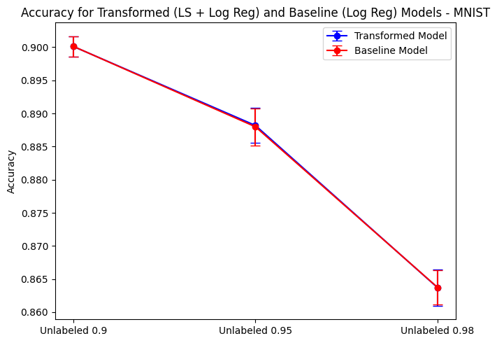
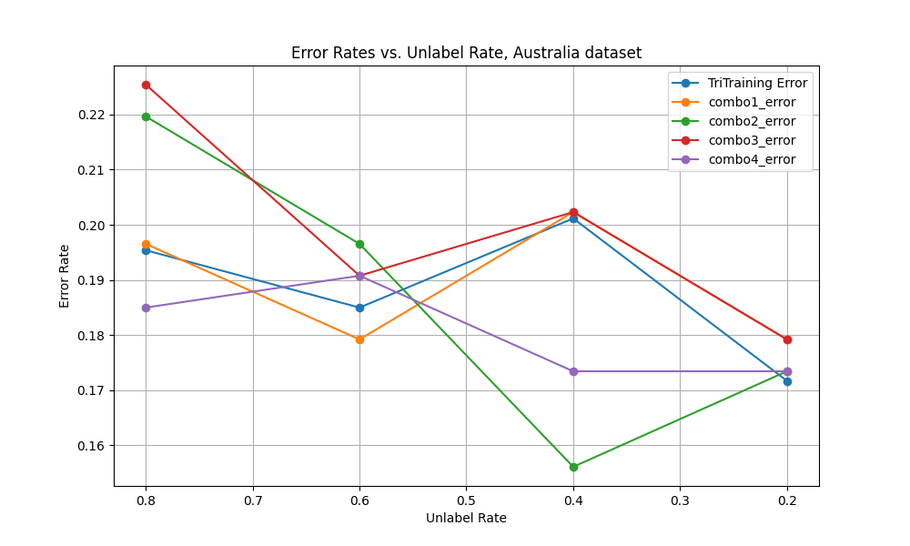
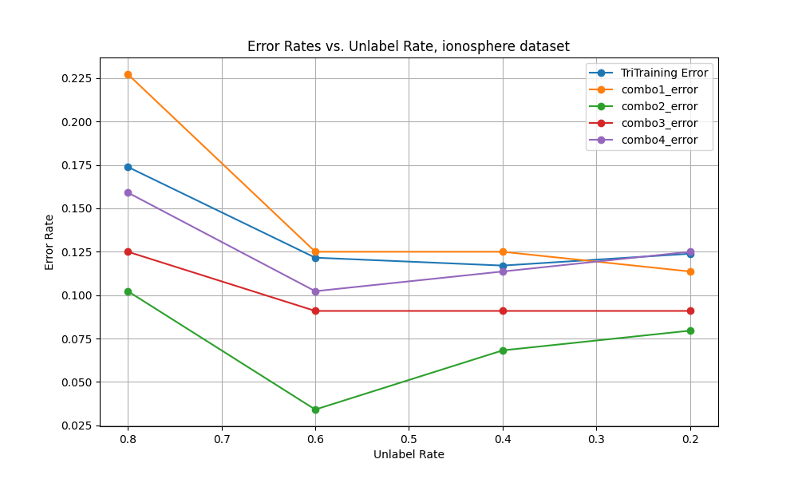
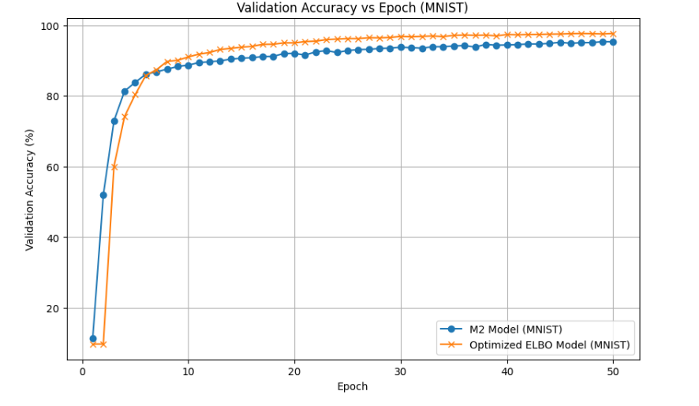

# Group N Comparison

## Methods

The methods in this study all come from our original seed paper. Overall, it discusses the motivations and assumptions behind semi-supervised learning. Semi-supervised learning is motivated because labeled data is often expensive and time-consuming to obtain, while unlabeled data is abundant and readily available. Many methods assume that the data lies in a low-dimensional space, and that points close to each other in that space are likely to have the same label, or that the decision boundary between classes should lie in low-density regions. The paper goes over the most important semi-supervised learning algorithms.

1. **Method 1**: Harmonic Minimization Method: The harmonic minizmization method is a graph based learning algorithm for semi-supervised learning. It constructs a graph where each data point is a node, and the edges represent the similarity between them. The algorithm minimizes a cost function that encourages similar points to have similar labels while respecting the known labels, iteratively updating the labels of the unlabeled data points by solivng a harmonic function until convergence.  This method was contributed by Weston Mansier. [Weston's Report](wlm35/Weston_Mansier_Project_Report.md).

2. **Method 2**: Mean teachers are better role models: Weight-averaged consistency targets improve semi-supervised deep learning results. This method was contributed by [Prasanna Kumar peram]. You can find more details in their individual report: [https://github.com/cwru-courses/csds440project-f24-2/blob/main/pxp488/PrasannaKumarPeram_Project_Report.md].
3. **Method 3**: modifiedTriTraining. This method was contributed by Sean Brown. You can find more details in their individual report: [[link to individual report 3](https://github.com/cwru-courses/csds440project-f24-2/blob/main/smb318/Sean_Brown_Project_Report.md)].
4. **Two-view Feature Generation Model**: 

The key idea in this approach is to define a set of auxiliary problems to enhance semi-supervised learning. Unlike co-training, where each view is assumed to be sufficient for classification, this method uses one view ($z_2$) to predict some function of the other view ($m(z_1)$), with $m$ indexing different auxiliary problems. These auxiliary tasks can be trained on unlabeled data.

A linear model, $w_m^\top z_2$, is used to fit $m(z_1)$, and the weight vector $w_m$ is learned from all the unlabeled data. Each weight vector $w_m$ has the same dimension as $z_2$. Some dimensions of the set of weights may be more important, indicating that corresponding dimensions in $z_2$ are more useful for the task.

Singular Value Decomposition (SVD) is applied to the matrix of weights to extract a compact representation of $z_2$, and a similar transformation is done for $z_1$ by swapping the roles of $z_1$ and $z_2$. The original representation $(z_1, z_2)$ is then concatenated with the new representations of $z_1$ and $z_2$ to create a new feature vector. This new representation incorporates information from unlabeled data and the auxiliary problems, and is used in standard supervised learning with labeled data. The selection of appropriate auxiliary problems is very important to this approach.
4. **Method 4**: **Optimized-ELBO for Semi-Supervised Learning**(By Ravi Raj Kumar (rxk789)): [https://github.com/cwru-courses/csds440project-f24-2/tree/main/rxk789]  
   This method is based on the integration of the Optimized-ELBO framework into the semi-supervised Variational Autoencoder (VAE) M2 model. Key enhancements include entropy regularization, mutual information maximization, and a direct optimization term for the labeled ELBO using label smoothing and cross-entropy loss. These adjustments address the issues identified in the original M2 model, such as entropy mismanagement and poor utilization of labeled data, to improve classification performance and alignment with the cluster assumption.  
## Results, Analysis, and Discussion

### Experiments

Experiment: Analyzing the impact of varying unlabeled set sizes on model performance
### Experiment

- **Dataset**: For this experiment, we used the MNIST image classification dataset. 
- **Methodology**: Semi-supervised learning algorithms separate the dataset into partitions where some examples are given labels and other examples are stripped of theirs. The proportion of examples that do not have labels has a significant impact on the performance of the method. Ideally, the methods will perform well with very few available labels. For this experiment, we set the unlabeled sets to be of proportions 0.9, 0.95, and 0.98 of the entire dataset. We then plotted their accuracy to get a measure of which methods perform best when very little labeled data is provided.

### Results

- **Results for Method 1**:

**MNIST dataset**

- **Results for Method 1**: Provide the outcome of experiments conducted using Method 1.
- **Results for Method 2**:
       Different times different epoch values are given to check the validation accuracy and traning loss
          Below is a table summarizing the average accuracy and loss over different epochs during the training process:(mean- teachers)
          
          | Epochs | Average  Accuracy (%) | Average Training Loss |
          |--------|----------------------|-----------------------|
          | 10     | 97.61                | 0.08237               |
          | 20     | 98.43                | 0.0355                |
          | 30     | 98.40                | 0.0280                |
          
          This table illustrates the progression of the model's performance, showing improvements in accuracy and reductions in loss as the number of training epochs increases.
          
          
          Below is a table summarizing the average accuracy and loss over different epochs during the training process: (for mean- teachers+mixmatch)
          
          | Number of Epochs | Average Training Loss | Average  Accuracy (%) |
          |------------------|-----------------------|---------------------------------|
          | 10               | 1.73                  | 87.37                           |
          | 20               | 1.69                  | 87.53                           |
          | 30               | 1.63                  | 88.78                           |

- **Two-view Feature Generation Model**:

This model did not perform better than a base logistic regression model. Compared to the other methods, this was not as effective, with a noticeable lower loss when compared to Methods 1 and 2. This method was likely more simple compared to the other semi-supervised methods implemented and did not learn as much from the unlabeled data.

- **Results for Method 3**:
Below are the performances of method 3 on the "Australia" and "ionosphere" datasets, respectively (both are from the UCI ML repository). 

 

As we can see from the plots above, modifiedTriTraining produces a higher error rate than the other methods, using a lower unlabel rate. 

## **Results, Analysis, and Discussion for method 4**

### **Experiments**

#### **Dataset**
The experiments were conducted on the following datasets:
1. **MNIST**: 
2. **CIFAR-10**
#### **Methodology**
- **Evaluation Metrics**: Classification accuracy, entropy, and mutual information were evaluated over 50 epochs.
- **Hyperparameters**: Consistent settings were used across methods to ensure fair comparisons:
  - Latent Dimension: 50
  - Batch Size: 128
  - Learning Rate: \(1e-3\)
  - Optimizer: Adam
  - Number of Epochs: 50
- **Architectural Details**:  
   The original M2 model's MLP architecture was replaced with a CNN-based encoder-decoder architecture for image datasets.

---

### **Results**

#### **MNIST**
- **Original M2 Model**: Achieved an accuracy of 95.3%.
- **Optimized-ELBO**: Improved accuracy to 97.8%, representing a 2.5% gain.

#### **CIFAR-10**
- **Original M2 Model**: Achieved an accuracy of 40.2%.
- **Optimized-ELBO**: Improved accuracy to 42.2%, representing a modest 2% gain.

| **Dataset** | **Model**        | **Accuracy (%)** | **Improvement (%)** |
|-------------|------------------|------------------|---------------------|
| **MNIST**   | Original M2      | 95.3             | +0.0               |
|             | Optimized-ELBO   | 97.8             | +2.5               |
| **CIFAR-10**| Original M2      | 40.2             | +0.0               |
|             | Optimized-ELBO   | 42.2             | +2.0               |

---

### Analysis and Discussion

The results of this experiment on the MNIST dataset are similar to the results provided in the initial paper, with slightly lower performance after the research extension of dynamic weights was applied. We mostly used the MNIST dataset for our comparisons. The MNIST dataset is an image dataset used for classifying handwritten numbers. Overall, our implementations give a broad coverage of the field of semi-supervised learning. Potentially, these methods could be combined in future research. For example, Sean's research on Tri-training would be complementary with Stephanie's research on view learning.

 

