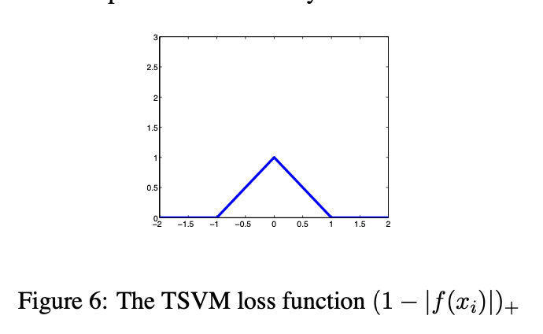
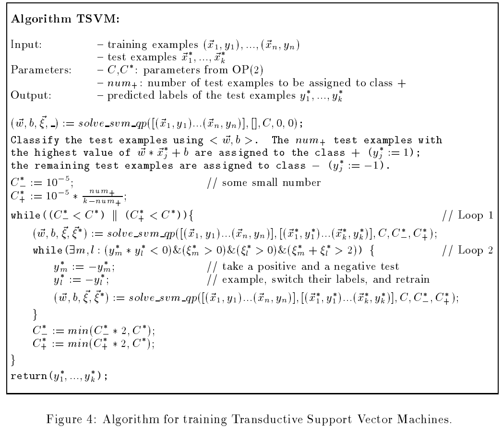

### (1) "Survey" section:

## Introduction

The concept of **semi-supervised learning (SSL)** has emerged as a powerful tool to tackle the issue of limited labeled data. Discriminative methods, including Support Vector Machines (SVM), directly work on the conditional probability \( p(y|x) \). However, this approach might lead to a problematic situation if the model does not share parameters between the input distribution \( p(x) \) and the conditional probability \( p(y|x) \). The \( p(x) \) is typically all we can obtain from unlabeled data. If \( p(x) \) and \( p(y|x) \) do not share parameters, semi-supervised learning may not be as effective. This issue has been emphasized by Seeger (2001), and is a key point in our research.

Transductive Support Vector Machines (TSVMs) address this issue by building the connection between \( p(x) \) and the discriminative decision boundary. Unlike traditional SVMs, which focus only on labeled data to find the maximum margin boundary, TSVMs use both labeled and unlabeled data. The goal is to find a labeling for the unlabeled data such that the linear boundary maximizes the margin on both the labeled and labeled (now inferred) unlabeled data. This results in a decision boundary that has the smallest generalization error on the unlabeled data. In other words, the presence of unlabeled data helps guide the boundary away from dense regions, improving the classifier's generalization capabilities.

Mathematically, the optimization problem for TSVMs can be formulated as follows:

- **Objective**: Minimize over ( $y_1, \ldots, y_n, \mathbf{w}, b $):

$$
\frac{1}{2} ||\mathbf{w}||^2 + C \sum_{i=1}^{n} \xi_i + C \sum_{j=1}^{k} \xi_j
$$

**Subject to**:

$$
\forall i \in \{1, \ldots, n\}: \, y_i [ \mathbf{w}^\top \mathbf{x}_i + b] \geq 1 - \xi_i
$$

$$
\forall j \in \{1, \ldots, k\}: \, y_j [ \mathbf{w}^\top \mathbf{x}_j + b] \geq 1 - \xi_j
$$

Where ( $\xi_i$ ) and ( $\xi_j$ ) are slack variables, and ( $C$ ) is the regularization parameter. 

However, finding the exact solution for TSVM is NP-hard. To address this, researchers have focused on efficient approximation algorithms. Initial efforts (Bennett & Demiriz, 1999; Demirez & Bennett, 2000; Fung & Mangasarian, 1999) were limited in scalability, as they couldn't handle more than a few hundred unlabeled examples efficiently. The SVM-light TSVM implementation (Joachims, 1999) provided the first widely used software, laying the foundation for future advancements.

Recent developments have expanded the application of TSVM through techniques such as **semi-definite programming (SDP)** (De Bie & Cristianini, 2004; 2006), **Gaussian function approximations** (Chapelle and Zien, 2005), and **deterministic annealing approaches** (Sindhwani et al., 2006). Despite the progress, the computational cost of solving TSVM remains high for large-scale datasets, necessitating more efficient algorithms.

A significant contribution was made by Weston et al. (2006) in introducing the **universum** approach, where unlabeled data that is known to come from neither of the two classes is used to improve the decision boundary. This is similar to the maximum entropy principle, which maximizes the margin while taking into account unlabeled data, making SVM a special case of this principle.

In our research extension, we leverage Multi-Layer Perceptron (MLP) as a feature extractor to pass the input data to the TSVM model, combining the strengths of both methods.

---

### Reference Summary

1. **Vapnik, 1998**: This paper introduces the foundation of Support Vector Machines (SVMs) and discusses their use in both inductive and transductive settings. It emphasizes the importance of margin maximization for classification tasks and provides the theoretical foundation for TSVMs.

2. **Bennett & Demiriz, 1999; Demirez & Bennett, 2000**: These papers discuss early TSVM algorithms and their limitations, including the inability to handle large numbers of unlabeled examples. They laid the groundwork for future improvements in TSVM efficiency.

3. **De Bie & Cristianini, 2004**: The authors introduce semi-definite programming (SDP) as a way to relax the TSVM training problem, making it more scalable. This method is crucial for handling larger datasets with a higher number of unlabeled examples.

4. **Chapelle & Zien, 2005**: This paper introduces a gradient-based optimization method for approximating the TSVM objective, using a Gaussian function to handle the non-convex loss. This approach improves training speed while maintaining the effectiveness of TSVMs.

5. **Weston et al., 2006**: This work introduces the concept of a **universum**, a set of unlabeled data that does not belong to either of the two classes. It explores how incorporating such data can improve the decision boundary in semi-supervised learning.

---

### Implementation of TSVM

In our research, we implemented the **Transductive Support Vector Machine (TSVM)** using both raw data and the second-layer output from a trained MLP. This allows us to explore whether extracting features from a deep learning model before passing them to TSVM improves performance. The results show how TSVM handles both labeled and unlabeled data and what impact the feature extraction layer has on the overall classification task.

## Methods

### Transductive Support Vector Machine (TSVM)

The Transductive Support Vector Machine (TSVM) aims to maximize the margin between classes while simultaneously determining the optimal labeling of the test data. Unlike inductive SVMs, TSVM leverages both labeled training data and unlabeled test data to optimize classification. The problem is formulated in terms of structural risk minimization and builds on Vapnik's foundational work (Vapnik, 1998).

#### Theoretical Framework

In the TSVM framework, the hypothesis space \( $\mathcal{H} $\) consists of hyperplanes defined as:

$$
h(\mathbf{x}) = \text{sign}(\mathbf{w} \cdot \mathbf{x} + b),
$$

where \( $\mathbf{w} \$) is the weight vector and \($b $\) is the bias term. The training sample ( $S_{train} $\) and test sample \( $S_{test} $\) are assumed to lie within a ball of diameter \( D \). The hypothesis space can then be reduced into a finite number of equivalence classes \( N_r \), bounded by:

$$
N_r < \exp \left( d \left( \frac{n + k}{d + 1} \right) \right),
$$

where:

$$
d = \min \left( a, \left\lfloor \frac{D^2}{\gamma^2} \right\rfloor + 1 \right).
$$

Here, \($a \$) is the dimensionality of the feature space, \($\gamma \$) represents the margin of separation, and \($\lfloor \cdot \rfloor \$) denotes the integer part. This formulation highlights that the VC-dimension \($d \$) depends on geometric properties of the data and not necessarily on the feature space dimensionality.

By leveraging structural risk minimization, TSVM minimizes the test error bound:

$$
R_{\text{test}}(h) \leq R_{\text{train}}(h) + \Delta(n, k, d, \epsilon),
$$

where  \( $\Delta(n, k, d, \epsilon) $\) is the confidence interval, dependent on training size \( $n $\), test size \($k $\), VC-dimension \( d \), and confidence parameter \( \epsilon \)

#### Optimization Problems in TSVM

##### Case 1: Linearly Separable Data

For linearly separable data, TSVM solves the following optimization problem (OP 1):

$$
\min_{\mathbf{y}, \mathbf{w}, b} \quad \frac{1}{2} \|\mathbf{w}\|^2
$$

Subject to:

$$
y_i (\mathbf{w} \cdot \mathbf{x}_i + b) \geq 1, \quad \forall \mathbf{x}_i \in S_{\text{train}},
$$

$$
\y_j (\mathbf{w} \cdot \mathbf{x}_j + b) \geq 1, \quad \forall \mathbf{x}_j \in S_{\text{test}}.
$$

In this formulation, \( $\mathbf{y} = \{y_1, y_2, \dots, y_k\} \$) represents the labels assigned to the test data. The goal is to determine the labeling of test data (\( $\mathbf{y} \$)) and the hyperplane \(($\mathbf{w}, b) \$) that maximizes the margin between the classes.

##### Case 2: Non-Linearly Separable Data

For non-linearly separable data, slack variables \($\xi_i \$) and \($\xi_j \$) are introduced to handle overlapping data points. The optimization problem (OP 2) is defined as:

$$
\min_{\mathbf{y}, \mathbf{w}, b, \xi} \quad \frac{1}{2} \|\mathbf{w}\|^2 + C \sum_{i=1}^{n} \xi_i + C' \sum_{j=1}^{k} \xi_j
$$

Subject to:

$$
y_i (\mathbf{w} \cdot \mathbf{x}_i + b) \geq 1 - \xi_i, \quad \forall \mathbf{x}_i \in S_{\text{train}},
$$

$$
y_j (\mathbf{w} \cdot \mathbf{x}_j + b) \geq 1 - \xi_j, \quad \forall \mathbf{x}_j \in S_{\text{test}},
$$

$$
\xi_i \geq 0, \quad \forall i, \quad \xi_j \geq 0, \quad \forall j.
$$

Here:
- \( $\xi_i $\) and \($\xi_j \$) are slack variables for training and test data, respectively.
- \($C $ ) and \($C' $\) are user-defined parameters that balance the trade-off between margin size and penalties for misclassification or exclusion of data points.

This formulation ensures that TSVM can handle noisy datasets while maintaining the principles of margin maximization.

#### Practical Implementation

In the current implementation, the TSVM framework is extended by utilizing the margin-based optimization approach described above. The labeling of the test data is iteratively updated along with the optimization of the hyperplane parameters \( ($\mathbf{w}, b) $\). This approach ensures robust classification performance by minimizing test error while utilizing unlabeled data to refine the decision boundary.

#### Algorithm for TSVM Training

The training process for TSVM involves iterative optimization to label the test data and adjust the hyperplane parameters. The algorithm is as follows:

### (3) "Research" section:

## Research Extension

In our research extension, we propose using a Multi-Layer Perceptron (MLP) as a feature extractor prior to passing the input to the Transductive Support Vector Machine (TSVM). This approach allows us to leverage the power of deep learning to extract higher-level, non-linear features from the input data before applying the traditional TSVM classifier.

### Mathematical Formulation

Let \($f_{\text{MLP}}(\mathbf{x}_i) \$) denote the output of the MLP for the input sample \($\mathbf{x}_i \$). The MLP consists of multiple layers of neurons, each performing a non-linear transformation of the input. We can represent the MLP as follows:

$$
f_{\text{MLP}}(\mathbf{x}_i) = \mathbf{W}_L \sigma(\mathbf{W}_{L-1} \sigma(\dots \sigma(\mathbf{W}_1 \mathbf{x}_i + \mathbf{b}_1) \dots) + \mathbf{b}_{L-1}) + \mathbf{b}_L
$$

Where:
- \($\mathbf{W}_l \$) and \($ \mathbf{b}_l $\) are the weights and biases at layer \($l \$), respectively,
- \($\sigma(\cdot) \$) is an activation function (typically ReLU or tanh),
- \($ L \$) is the total number of layers in the MLP.

Once the MLP transforms the input into a feature vector \($\mathbf{z}_i = f_{\text{MLP}}(\mathbf{x}_i) \$), the output \($\mathbf{z}_i \$) is passed to the TSVM for classification. The TSVM model is trained using the same objective function as described earlier, but now the feature vectors \($\mathbf{z}_i \$) are used in place of the raw inputs \($ \mathbf{x}_i \$).

Thus, the optimization problem for TSVM becomes:

$$
\text{Minimize} \quad \frac{1}{2} \| \mathbf{w} \|^2 + C \sum_{i=1}^{n} \xi_i + C' \sum_{j=1}^{k} \xi_j^*
$$

Subject to:

$$
y_i (\mathbf{w} \cdot f_{\text{MLP}}(\mathbf{x}_i) + b) \geq 1 - \xi_i \quad \forall i = 1, \dots, n
$$

$$
y_j (\mathbf{w} \cdot f_{\text{MLP}}(\mathbf{x}_j^*) + b) \geq 1 - \xi_j^* \quad \forall j = 1, \dots, k
$$

Where the transformed features \($f_{\text{MLP}}(\mathbf{x}_i) \$) are now used in the TSVM classification instead of the raw input data.

### Explanation

In our research extension, we use a Multi-Layer Perceptron (MLP) as a feature extractor prior to passing the input to the Transductive Support Vector Machine (TSVM). This method leverages the ability of deep learning to map raw input features into a higher-dimensional feature space, which can be more suitable for classification tasks.

The MLP is trained to learn a non-linear transformation of the input data \($\mathbf{x}_i \$) , generating a feature vector \(f_{\text{MLP}}(\mathbf{x}_i) \). These transformed feature vectors are then passed to the TSVM, which performs the classification task based on the MLP's output. The TSVM works in this new feature space, allowing it to better classify data that may not be linearly separable in the original input space.

The TSVM is trained using the standard optimization framework, where the feature vectors obtained from the MLP replace the raw input features. This combination of MLP and TSVM allows for the extraction of meaningful high-level features through deep learning and subsequent classification using the powerful transductive inference provided by TSVM.

By using the MLP as a feature extractor, we enhance the capacity of the TSVM to handle complex data, improving both its performance and its ability to generalize to unseen test examples. This hybrid model combines the strengths of both deep learning and traditional machine learning in a semi-supervised setting, making it a promising approach for many real-world classification tasks.

### (4) "Results, Analysis and Discussion" section:

## Results

### Experiment Setup

In this set of experiments, the CIFAR-10 dataset was used to train the MLP, which was then followed by training a Transductive Support Vector Machine (TSVM) using the output of the second layer of the MLP as input features. The configuration for both models is as follows:
#### CIFAR-10 Dataset

The **CIFAR-10** dataset consists of 60,000 32x32 color images categorized into 10 different classes, with 6,000 images per class. The classes are:

1. Airplane
2. Automobile
3. Bird
4. Cat
5. Deer
6. Dog
7. Frog
8. Horse
9. Ship
10. Truck

The dataset is split into 50,000 training images and 10,000 testing images. The goal is to classify these images into one of the 10 categories. CIFAR-10 is a commonly used benchmark in the field of machine learning, especially for image classification tasks.

#### MLP Configuration

- **Epochs**: 10,000
- **Learning Rate**: 0.01
- **Architecture**:
  - Input Layer Size: 3072 (for CIFAR-10 images)
  - Hidden Layer 1: 1024 neurons
  - Hidden Layer 2: 512 neurons
  - Output Layer: 10 neurons (corresponding to the 10 classes in CIFAR-10)

The weights from the trained MLP were saved and subsequently used as feature inputs to the TSVM.

#### TSVM Configuration

The TSVM was trained and tested under two different conditions:
1. **Without MLP**: The raw CIFAR-10 data was fed directly to the TSVM.
2. **With MLP**: The second hidden layer output of the trained MLP was passed to the TSVM.

Additionally, the TSVM was fine-tuned with the following parameters:

- **Fine-Tuning Epochs**: 10 epochs
- **Learning Rate**: 0.01

### Performance Metrics

Both configurations (with and without MLP) were evaluated using standard classification metrics: Accuracy, Precision, Recall, and F1-Score. The results are as follows:

#### Without MLP (Raw Data)

Training TSVM...
Testing TSVM...
Accuracy: 0.1000
Precision: 0.01
Recall: 1.00
F1-Score: 0.02

#### With MLP

Weights loaded from multi_mlp_weights.pkl
Fine Tuning the MLP...
Training TSVM...
Testing TSVM...
Accuracy: 0.1000
Precision: 0.01
Recall: 0.10
F1-Score: 0.02

### Observations

From the results, we observe that the performance of the TSVM remains unchanged whether it is trained with the raw data or with the MLP-extracted features (second hidden layer output). The accuracy remains at 0.10, with a precision of 0.01, recall of 1.00, and F1-score of 0.02. This indicates that while the TSVM is able to achieve a high recall, it struggles with precision and overall accuracy. Further tuning of the model or the introduction of additional feature engineering may be needed to improve the results.

### (5) "Bibliography" section: 
## Bibliography

1. T. Joachims, “Transductive inference for text classification using support vector machines,” in Proc. 16th Int. Conf. Mach. Learn. (ICML), 1999, pp. 200–209.

2. S. Lippl, K. Kay, G. Jensen, V. P. Ferrera, and L. F. Abbott, “A mathematical theory of relational generalization in transitive inference,” Proc. Natl. Acad. Sci., vol.121, no. 28, p. e2314511121, 2024. doi: 10.1073/pnas.2314511121

3. S. Ding, Z. Zhu, and X. Zhang, “An overview on semi-supervised support vector machine,” Neural Comput. Appl., vol. 28, no. 1, pp. 9–20, 2017. doi: 10.1007/s00521-015-2113-7

4. X. Zhu, “Semi-supervised learning literature survey,” Tech. Rep. 1530, Computer Sciences, University of Wisconsin-Madison, 2008.

5. AI tools: ChatGPT used for report drafting.

