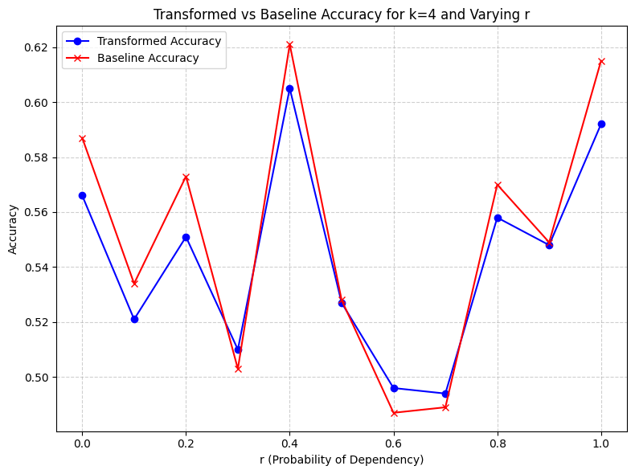
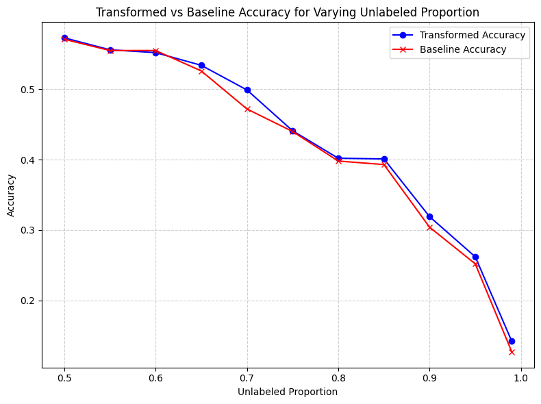
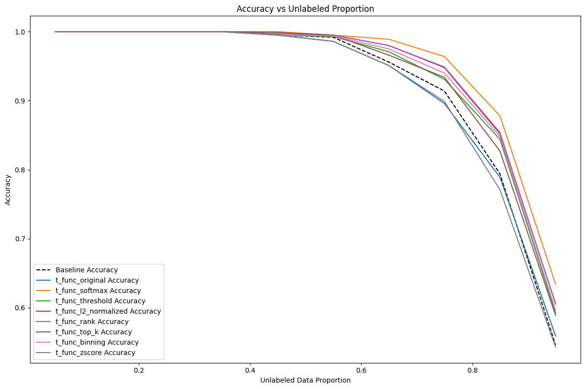
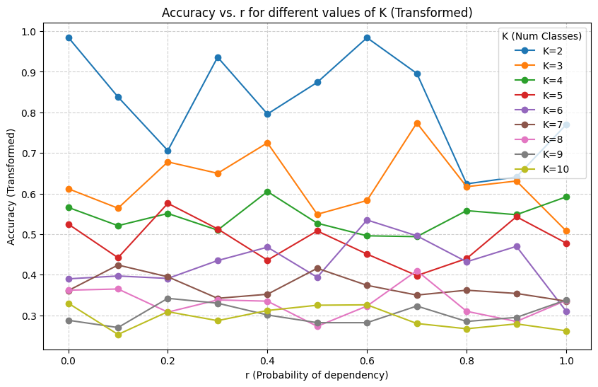
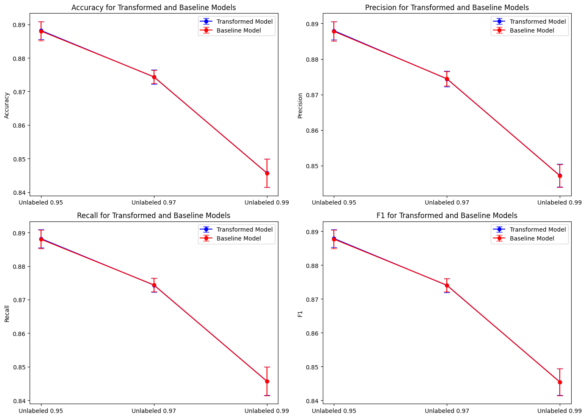
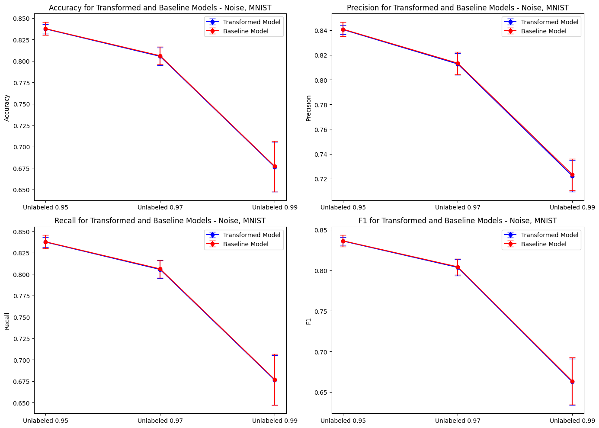
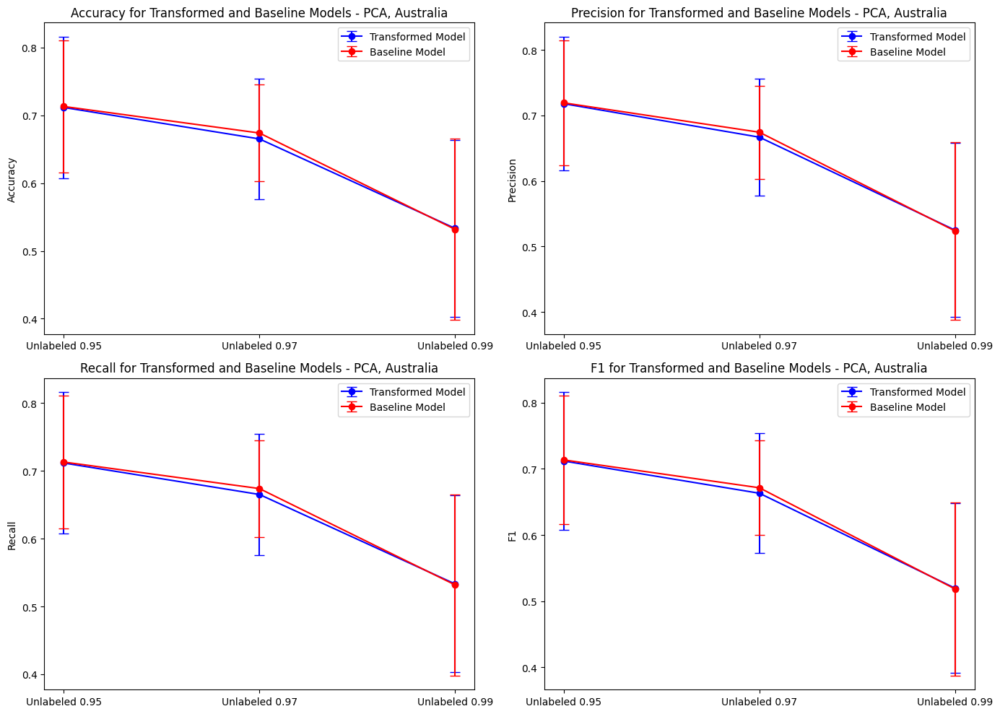

# Stephanie Little Project Report

## 1. Survey

### 1.1 Overview of the Papers
- Semi-Supervised Learning Literature Survey (seed paper)

This was our seed paper. Notably, it was published in 2005, so it does not reference the most up to date papers, but gives a good overview. Overall, it discusses the motivations and assumptions behind semi-supervised learning. Semi-supervised learning is motivated because labeled data is often expensive and time-consuming to obtain, while unlabeled data is abundant and readily available. Many methods assume that the data lies in a low-dimensional space, and that points close to each other in that space are likely to have the same label, or that the decision boundary between classes should lie in low-density regions. The paper goes over the most important semi-supervised learning algorithms. Relevant to this paper, it introduces both co-training and my topic, encoding of the domain from unlabeled data.
- Combining Labeled and Unlabeled Data with Co-Training

This paper introduces co-training, a semi-supervised learning algorithm that uses two distinct views of each example to learn from unlabeled data. Co-training assumes that each view is sufficient for learning if enough labeled data is available. However, the goal is to use both views together to allow unlabeled data to augment a smaller set of labeled examples.
- A Framework for Learning Predictive Structures from Multiple Tasks and Unlabeled Data

This paper introduces a framework for semi-supervised learning called structural learning, which improves the performance of supervised learning algorithms by using unlabeled data. The key idea is to learn predictive structures, which represent the underlying relationships between features and labels, from multiple learning tasks. These structures can then be used to improve the performance of a supervised learning algorithm on a target task.
- Two-view Feature Generation Model for Semi-supervised Learning

This paper looks at a two-view feature generation model for semi-supervised learning, where the input features form two subsets. It tries to relax some of the assumptions from co-training, with particular focus on the assumption that the two views are conditionally independent given the class label. The paper focuses on learning good feature representations from unlabeled data for discriminative learning. This is the paper I focused the most on in my work.
- A Simple Framework for Contrastive Learning of Visual Representations

This paper presents SimCLR, a framework for learning visual representations using contrastive learning. The framework learns representations by maximizing agreement between differently augmented views of the same image, while minimizing agreement between augmented views of different images.
  
### 1.2 Explanation of Key Concepts and Findings
- Combining Labeled and Unlabeled Data with Co-Training

Co-training is a semi-supervised learning technique that uses the presence of two distinct "views" of each example to improve classification accuracy using both labeled and unlabeled data. It operates under the assumption that each view, when considered in isolation, is sufficient to learn the target concept if enough labeled data were available.

Assumptions: 
- Two views: Each example can be described using two different kinds of information, denoted as $X_1$ and $X_2$. For instance, in web page classification, $X_1$ could be the words on the page itself, while $X_2$ could represent the words in hyperlinks pointing to the page.
- View Redundancy: Each view alone should be sufficient for learning the target concept if there were enough labeled examples. This implies a certain level of redundancy between the views, meaning they contain overlapping information about the target concept.
- Conditional Independence: Given the class label of an example, the two views are assumed to be conditionally independent. This means that knowing the value of one view shouldn't give additional information about the other view if we already know the class label

Methodology:
- Initialization: Begin with a small set L of labeled examples and a larger set U of unlabeled examples.
- Separate Classifiers: Train two separate classifiers, h1 and h2, each focusing on one of the views. For example, h1 would learn from the x1 portion of the data and h2 from the x2 portion.
- Iterative Labeling: Each classifier examines the unlabeled set U and selects a small number of examples it is most confident in labeling. This selection is typically based on the classifier's output probabilities or confidence scores. The selected examples, along with their predicted labels, are added to the labeled set L.
- Classifier Retraining: Retrain both classifiers h1 and h2 using the updated labeled set L.
- Repeat: Repeat steps 3 and 4 for a specified number of iterations or until a stopping criterion is met.

Key idea: The core principle behind co-training is bootstrapping. Each classifier, by confidently labeling examples from the unlabeled set, effectively expands the training data for the other classifier. This cross-training process allows the classifiers to leverage the information from both views, leading to improved accuracy even with limited labeled data.

Results: The sources present experimental results on web page classification, showing that co-training significantly outperforms supervised learning using only the labeled data.

- A Framework for Learning Predictive Structures from Multiple Tasks and Unlabeled Data

The key idea behind this paper is to learn predictive structures shared across tasks.

Empirical Risk Minimization:

ERM aims to minimize the empirical risk (average loss on training data) rather than the true risk (expected loss on unseen data). Given a dataset $\{(X_i, Y_i)\}_{i=1}^n$, a hypothesis space $\mathcal{H}$, and a loss function $L(\hat{y}, y)$, ERM minimizes the empirical risk:
$$
\hat{f} = \arg \min_{f \in \mathcal{H}} \frac{1}{n} \sum_{i=1}^n L(f(X_i), Y_i)
$$

Auxiliary Tasks:

Auxiliary tasks are smaller prediction problems defined in the unlabeled data, related to the target problem. They help identify predictive structures, which improve performance on the target task if they share common patterns.

Key Elements of Auxiliary Tasks
- Automatic Labeling: Labels for auxiliary tasks are generated automatically from unlabeled data.  
- Relevancy: Auxiliary tasks should share a predictive structure with the target task.  

Strategy for Auxiliary Tasks
- Identify observable substructures in input data $X$ (e.g., predicting the current word using surrounding words in word tagging).  
- Feature Masking: Mask specific features in the input and predict them using the unmasked features (e.g., predicting bigrams by masking).  

SVD-Based Alternating Structure Optimization Algorithm (SVD-ASO)

The **SVD-ASO** algorithm identifies a shared structure across tasks to improve predictive performance by leveraging related task information.

Algorithm Steps

Input
- Training data: $(X_i^\ell, Y_i^\ell)$ for each task $\ell$.  
- Hyperparameters:  
  - $h$: Rank of shared structure.  
  - $\lambda_1, \lambda_2, \dots, \lambda_m$: Regularization coefficients for task-specific models.  

Output: Shared structure ($\Theta$): A matrix capturing common patterns across tasks.  

#1. Initialization**  
- Set task-specific parameters $u_\ell = 0$ for each task $\ell$.  
- Randomly initialize the shared structure $\Theta$.  

Update Task-Specific Parameters 
For each task $\ell$:
1. Compute task-specific projection $v_\ell$ from $\Theta$.  
2. Update task parameter $\hat{w}_\ell$ to minimize the loss.  
3. Update $u_\ell$ using $\hat{w}_\ell$ and $\Theta$.  

Update Shared Structure ($\Theta$)* 
1. Combine task parameters into matrix $U$.  
2. Apply **SVD** on $U$ to extract shared components.  
3. Update $\Theta$ using the top $h$ components from the SVD.  

4. Repeat
Repeat steps 2-3 until convergence (when $\Theta$ and $u_\ell$ stabilize).  

Key Concepts:
- Shared Structure ($\Theta$): Captures common patterns across tasks.  
- Task-Specific Parameters ($w_\ell$): Unique model parameters for each task.  
- SVD: Extracts shared components from task parameters for efficient structure learning.  

Experiments:
   - Tested on text categorization, natural language tagging, and image classification, showing significant improvements over supervised learning baselines.  
   - The method outperformed co-training (up to 8.4% improvement) in all settings tested.  

Notable Results:
   - Improved generalization, even when tasks have limited labeled data. 
   - **Text Categorization**: The method achieved up to 8.4% improvement over co-training.  
   - **NER (Named Entity Recognition)**: Even with 200K words, adding unlabeled data improved performance.  
   - **MNIST**: Partially supervised auxiliary problems resulted in performance above the baseline.  

Drawbacks:
- Defining Auxiliary Problems: Requires explicit definition of auxiliary tasks, which may be challenging for some domains.

- **Two-view Feature Generation Model for Semi-supervised Learning**

Key ideas:
- Generative + discriminative models: Similar to the previous paper, the authors emphasize the use of a generative model to model the underlying distribution of the data, so the model can learn from unlabeled data. Then a discriminative model can be fit using the encoded feature space.
- Two views: The method operates under the assumption that each data point can be represented using two different views, which are conditionally independent given the label ($ p(z_1, z_2 | y) = p(z_1 | y) p(z_2 | y) $). This concept is similar to the co-training setting, but the authors do not require each view to be sufficient for prediction on its own.
- Feature generation from unlabeled data: The central idea is to use unlabeled data to generate a small set of features that capture the essential information for classification. This reduces the dimensionality of the problem while preserving the necessary information for accurate prediction.

The key idea in this approach is to define a set of auxiliary problems to enhance semi-supervised learning. Unlike co-training, where each view is assumed to be sufficient for classification, this method uses one view ($z_2$) to predict some function of the other view ($m(z_1)$), with $m$ indexing different auxiliary problems. These auxiliary tasks can be trained on unlabeled data.

A linear model, $w_m^\top z_2$, is used to fit $m(z_1)$, and the weight vector $w_m$ is learned from all the unlabeled data. Each weight vector $w_m$ has the same dimension as $z_2$. Some dimensions of the set of weights may be more important, indicating that corresponding dimensions in $z_2$ are more useful for the task.

Singular Value Decomposition (SVD) is applied to the matrix of weights to extract a compact representation of $z_2$, and a similar transformation is done for $z_1$ by swapping the roles of $z_1$ and $z_2$. The original representation $(z_1, z_2)$ is then concatenated with the new representations of $z_1$ and $z_2$ to create a new feature vector. This new representation incorporates information from unlabeled data and the auxiliary problems, and is used in standard supervised learning with labeled data. The selection of appropriate auxiliary problems is very important to this approach.

Methodology:

Conditional Formulation: The method relies on estimating the conditional probabilities $P(y|z_1)$ and $P(y|z_2)$, where $z_1$ and $z_2$ represent the two views of the data. These probabilities are then used to derive the conditional probability $P(y|z_1, z_2)$, which is directly used for classification.

Auxiliary Problems: Instead of directly estimating the potentially complex conditional probability $P(z_1|z_2)$, the authors introduce a set of binary classification problems, referred to as "auxiliary problems." These problems involve predicting a binary function of one view given the other view. By solving these auxiliary problems, the model learns a parametric representation of the conditional probabilities $P(y|z_1)$ and $P(y|z_2)$.

Feature Embedding: The views $z_1$ and $z_2$ are embedded into high-dimensional Hilbert spaces using feature maps. This allows for a flexible representation of the data and enables the model to capture complex relationships between the views and the labels.

Linear Subspace Model: Under the assumption that the conditional probability $P(y|z_2)$ can be expressed as a linear combination of features in the Hilbert space, the authors show that the solutions to the auxiliary problems span a low-dimensional subspace. The basis vectors of this subspace are then used as features for the final classification model.

Log-Linear Mixture Model: Alternatively, the conditional probability $P(y|z_2)$ can be modeled as a log-linear combination of features. This leads to a probabilistic model that can be trained using the Expectation-Maximization (EM) algorithm.

Discriminative Training: Once the features are generated from the unlabeled data, a discriminative classifier is trained using the labeled data. The choice of classifier is flexible, and the authors demonstrate the effectiveness of their approach with linear classifiers.

Results: The paper presents experimental results on synthetic and real-world datasets, including text categorization, named entity chunking, part-of-speech tagging, and handwritten digit image classification. The results show that their approach can  outperform supervised baselines and alternative semi-supervised methods like co-training and EM. The authors argue that there is enough evidence to show that the conditional independence assumption might not always hold in practice.

Drawbacks: The paper relies on specific problems with clear . The authors also do not provide strong justification for their choice of auxiliary problems.

- A Simple Framework for Contrastive Learning of Visual Representations

SimCLR is a simple framework for contrastive learning of visual representations. SimCLR learns representations by maximizing the agreement between differently augmented views of the same data example via a contrastive loss in the latent space. (I thought this was really interesting, but I don't focus on it much below so I will keep it short). 

Key ideas:
- Data Augmentation: The composition of multiple data augmentation operations is used for defining effective predictive tasks
- Architecture: A learnable nonlinear transformation between the representation and the contrastive loss substantially improves the quality of the learned representations. The study found that a nonlinear projection head is better than a linear projection, and significantly better than no projection.
- Loss Function: The paper found that a normalized cross entropy loss with an adjustable temperature parameter works better than alternative loss functions.
- Training: Contrastive learning benefits from larger batch sizes and longer training compared to supervised learning. As the model size increases, the performance gap between supervised and unsupervised learning shrinks, indicating that unsupervised learning benefits more from larger models

Results:
- Linear Evaluation: SimCLR achieved 76.5% top-1 accuracy on ImageNet under the linear evaluation protocol, a 7% relative improvement over the previous state-of-the-art.
- Semi-Supervised Learning: When fine-tuned on only 1% of the ImageNet labels, SimCLR achieves 85.8% top-5 accuracy, outperforming AlexNet with 100× fewer labels.
- Transfer Learning: When fine-tuned on other natural image classification datasets, SimCLR performed on par with or better than a strong supervised baseline on 10 out of 12 datasets.

### Overall
The co-training and two-view feature generation papers focus on using multiple data views or auxiliary tasks, while the structural learning framework tries to improve performance by learning shared structures across tasks. SimCLR, in contrast, uses a completely different paradigm of contrastive learning to learn representations. Each method offers advantages depending on the task and data availability.

## 2. Methods

The main method I implemented in my project was the Linear Subspace (LS) model defined by Ando & Zhang [citation]. 

Overview: 

Theoretical motivation:

Algorithm:
This document explains the steps involved in implementing the Linear Subspace (LS) model-based method for a classification task. The algorithm follows these main steps:

We are given:
   - Two views $Z_1$ and $Z_2$.
   - $m$ binary-valued functions $t^\ell_i$ for $i \in \{1, 2\}$.
   - A labeled dataset $L$ and an unlabeled dataset $U$.

Compute the weight vectors:
    For each $\ell = 1, \dots, m$, we need to solve:
   
   $$
   w^\ell = \arg \min_w \sum_{(z_1, z_2) \in U} (w^T z_2 - t^\ell_2(z_1))^2
   $$
   
   This is done for each function $t^\ell_i$, where $\ell$ runs from 1 to $m$.

Construct Matrix W
   After computing the weight vectors $w^\ell$, construct a matrix $W$ where the columns are these weight vectors.

Compute Left Singular Vectors
   Now, compute the most significant left singular vectors of $W$. Let $v_1^2, \dots, v_p^2$ represent the left singular vectors, where $p$ is the dimensionality parameter.

Exchange the Roles of Views
   Next, exchange the roles of the two views and compute the left singular vectors for the swapped views:
   
   $$
   v_1^1, \dots, v_p^1
   $$

Generate Feature Vector:
   For each pair $(z_1, z_2)$, generate a $2p$-dimensional feature vector. This is done by computing:

   $$
   z_1^T v_i^1, \quad z_2^T v_j^2 \quad \text{for} \quad i = 1, 2 \dots, p \quad \text{and} \quad j = 1, 2, \dots, p
   $$
   
   The new feature vector is the concatenation of $z_1$, $z_2$, and the $2p$-dimensional vector obtained from the above computations.

Classifier Training:
   Finally, train the classifier using the labeled data $L$ and the newly constructed feature vector representation. This will involve using the features from the previous steps to train the model.

Choosing Dimensionality $p$:
   - In ideal cases, $p$ should be set to the number of classes $K$.
   - In practice, $p$ should be determined using cross-validation on the labeled data, as the number of inherent sub-classes may not be $K$.

Final discriminative classifier:
   - For my implementation, I used logistic regression on the transformed feature space and as a baseline implementation.

Auxiliary problems:
   - The auxiliary problems defined in the paper were defined to indicate which entry of the vector in a given view has the largest entry. I implemented this, but also implemented other versions because the paper did not provide good justification for their choice.

Views:
   - The data for my analysis comes from both synthetic and real datasets. For the synthetic datasets, I created underlying views and used those for the implementation. For creating views on new data, I used several other methods, as described below. 

Baseline:
   - Because I decided to use a logistic regression classigier to train on the trainsformed parameter space, I also used that as my baseline linear discriminator.

## 3. Research

Ando 2005 did feature splits by halving the images, but they used some supervision

Of the papers I read, most focused on specific settings where distinct views are inherently present. Therefore my motivation was to look at specifically how different view creation methods could be applied to different tasks. Specifically, I looked at the task of image classification. I did this using both synthetically generated and real (MNIST) data.

The Ando & Zhang paper that I implemented focuses on specific view tasks, so I wanted to look at how the algorithm could be improved to look at other tasks

I approached view creation methods in two ways: modifying how views were created via synthetic datasets and implementing other view creation methods on real data. 

First I investigated how creating synthetic datasets to quantify how different parameters, specifically degree of dependence, affects the results. The data generation method simulates two distinct image views, F1 and F2, by generating feature sets that are modeled using normal distributions or one-hot encodings. I created two sets of features, F1 and F2, each with a specified number of features. For the first version, the features are drawn from normal distributions with random means and fixed standard deviations (.05). For the second version, the features are represented as one-hot encoded vectors. These feature sets are then used to generate class-specific feature arrays, where each class has a set of randomly selected features from F1 and F2. A data point is generated by selecting a random class, then picking features from the class's feature arrays with dependencies introduced between the two views based on a specified probability. The generated features are drawn from the selected distributions, and a feature vector for both F1 and F2 is created for each data point. We allow for dependency between the views by including a parameter $r$, which is the probability that the feature vector for both the views will "correspond". What that means is that both of the feature vectors will be drawn from the same positions in their respective class-specific feature arrays. Therefore if $r$ is higher, then there will be more corresponding feature vectors and thus more redundancy. The method allows the degree of dependency between the views to be controlled, influencing how much the two views are linked. Finally, the method generates a dataset with these features and their corresponding labels, which are split between the two views, reflecting different image transformations or representations.

Then I tried different view creation methods for datasets without specific views. This is motivated by the problem specific approaches in most of the papers I read. 
1. Split the dataset into two features sets.
2. Split the dataset into two sets using PCA. This 
3. For the image data:
    - Rotating the image
    - Flipping the image
    - Adding noise to the image
4. The most interesting view creation method I used was contrastive learning, but currently that code does not run. But I will talk a little about the theory behind it. This was motivated because I wasn't very exciting results elsewhere. I actually read a lot about this and it was gonna be really cool. But I couldn't get the code doing what I wanted. But anyway here are my thoughts on why it would work well here.

In contrastive learning, the two views (or more) of a data point can be generated through different augmentations or transformations. The learning process encourages the model to map these augmented versions of the same instance into a shared, compact embedding space. I was interested to see whether that shared embedding space would help or improve the performance of the LS model. I hypothesize that it would significantly.

## 4. Results, Analysis and Discussion

My results were overall a bit underwhelming, but that also is meaningful. 

Part 1: Results on the synthetic data

The first result I looked at was the effect of varying the dependency parameter for the synthetic image dataset. This has significant consequences, as it directly models how important the model assumptions were. As shown in the graph below, the probability of dependency does not show a strong trend in its effect on model accuracy. Both the baseline logistic regression model and the model based on the transformed feature space outperform a random classifier (accuracy of .25 with 4 clusters), but neither show a strong trend with the value of r. Also, the linear subspace model slightly underperforms. This could simply be because the model is slightly overfitting. I followed the methodology of the Ando and Zhang paper (2007), where they ultimately stacked the transformed features with the transformed features to train their final model. Either way, the results indicate that perhaps the model assumption that the views are conditionally independent is not what makes co-training and multi-view learning so effective.

My second result from the synthetic data is looking at how the performance changes as the proportion of labeled data decreases. The graph below shows what we would expect, that the performance decreases with less labeled data. The linear subspace model slightly outperforms the baseline logistic regression. It is possible that is not higher because of redundant variables or because the LS model was not effective in this case.

My third result comes from my extension of trying different auxiliary problem functions. I was suspicious of the methodology used by Ando and Zhang paper (2007), so I implemented several other common functions. Once again I plotted performance based on proportion of unlabeled data to see how the performance would decline with the auxiliary problem function. The results show that most of the functions perform above the baseline. Interestingly, the original function (essentially argmax) that I implemented according to the paper and have been testing with (this is what motivated this research) performs below the baseline. The best performing function is the softmax function. This function is used to essentially parameterize $P(y|z_i)$, with the result of the function being used to minimize the loss between it and the weights. So using a function that reflects more of the distribution of $z_i$ makes sense here. The prior motivation behind having a binary function was to have simple auxiliary problems, but in this case that is likely not as nuanced enough of a representation.

Finally, I also looked at the effect of varying the number of clusters. The figure below shows how the accuracy degrades with the increasing number of clusters. We would expect this trend, as more clusters means lass distinct underlying dataset origin. 

Part 2: Results on the synthetic data

I used two real world datasets to evaluate: the MNIST number recognition dataset (images) and a generic binary classification dataset (called Australia). I chose to use these two because I wanted to test my hypotheses about image data, and use a simpler baseline to evaluate general accuracy. The plot below shows the baseline (logistic regression) and encoded feature space (LS) + logistic regression accuracy on the MNIST dataset. The results are not significantly different. One paper suggested that the dimensionality of each of the views should be equal to the number of classes. Intuitively, this makes sense as the goal of the feature vectors generated by the views is to represent the underlying distribution. (keep reading)

So I changed the hyperparameter to decrease the dimensionality of the represented features spaces from 64 to 10, the number of digits. The results are shown below. The accuracy significantly decreases, indicating that more features are needed for this dataset. Also note that I am using PCA here to encode the views. One view is the even principle components, and one view is the odds.

Next I looked at adding noise to represent another view of the dataset. The results for all of the image transformations were the same, so I do not include them all here. Once again, we see that this method is not effective at adding representation to the feature space. This could be overfitting, or it could be that the LS algorithm is simply not effective here, or possible the transformations and subsequent structure representation do not add any new information to the feature space.

Finally, I tried two different view creation methods for the Australia dataset. The first is PCA again using the alternating priciple component method. The second is Kernel PCA. The Kernel PCA method showed slightly better results than the regular PCA method.

Takeaways:
Dependency Between Views: The synthetic data experiments revealed that varying the dependency parameter $r$ did not result in significant changes in model accuracy. This suggests that the assumption of conditional independence between views (a central idea in many multi-view learning models) might not be the key driver of effectiveness. It's possible that other factors, such as the specific learning algorithm or the nature of the feature transformations, play a larger role in performance.

Auxiliary Problem Functions: The experiment with different auxiliary problem functions showed that a softmax function outperforms the original binary function (argmax) proposed in Ando and Zhang’s (2007) paper. This is significant as it suggests that more complex and nuanced auxiliary problems (i.e., those that consider the distribution of feature vectors) might be more effective than simpler, binary approaches in multi-view learning.

Overall, my results were not as good as I wanted them to be but they still have significance. I suspect I relied too heavilty on the linear subspace model that I implemented. The model possibly does not generalize well beyond the use cases in the paper I read. And, despite it being flawed, I potentially relied too much on the methodology used in that paper.

In the future, I woudl try a lot more combinations of approaches. One hyperparameter that I did not use enough was varying the number of auxiliary problems. Even though, I tried different functions to model the problems, I imagine some functions would need a higher number of them to get a good enough representation.

AI was used somewhat to help format this report.

## 5. Bibliography

