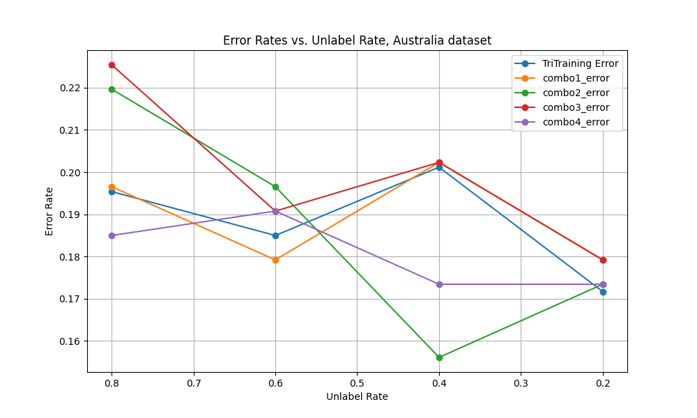

## Survey
I primarily used two papers for my research: Blum and Mitchell's paper introducing co-training, and Zhou and Li's paper introducing tri-training.

In their paper, Blum and Mitchell introduce the co-training algorithm, which uses labeled and unlabeled data. Two classifiers are trained on different feature sets of the labeled dataset, and each classifier labels the most confident unlabeled examples, providing the answers to the other classifier. Then, the classifiers retrain on the newly labeled data, and the process repeats iteratively until the labeled set no longer changes. The authors demonstrate that co-training can be effective when the feature sets are sufficient (e.g. enough to predict labels on its own) and redundant (the feature sets must be independent of each other given the class label).

I thought that this paper did an excellent job explaining the conditions under which co-training is likely to succeed. This provides a firm justification for the algorithm while also demonstrating its limitations. I thought that the comparison to a weighted bipartite graph was helpful. Third, I liked that the authors provided empirical data of the performance on real web-page data. This showed that the algorithm can improve performance in real-world scenarios. Some weaknesses of this paper are that the paper focuses on a two-view approach, and that it doesn't address how to handle pseudo-labeling in practice.

The other paper that I used was Zhou and Li's paper introducing tri-training. I thought that the authors did a great job making their paper easy to read despite large number of variables and equations to keep track of. Everything was well defined, and the pseudocode provided was easy to understand. Zhou and Li provided a strong justification for when the algorithm will improve performance, and make it clear how it is an upgrade over co-training.

However, like with co-training, it would have been nice for the authors to address the problem of pseudo-labeling. This is less of an issue than it is with co-training, given that we use 3 classifiers instead of 2, but it would have helped to have some discussion on how big an issue it is, what can be done about it, etc. I also thought that Zhou and Li could have used more base learners in their performance evaluation. As I will show in modifiedTriTraining, the base learner chosen can have a significant impact on performance.

## Methods
For my project, I implemented the tri training algorithm, which is a semi-supervised learning technique that leverages multiple classifiers to improve the performance of a model. In many applications, unlabeled training examples are much more available than labeled ones. As a result, co-training is a popular learning algorithm. In co-training, two classifiers (C1 and C2) are trained on two distinct, complementary views of a dataset (often split by their features). After the classifiers are trained on a labeled dataset, each classifier labels a portion of the unlabeled data. The most confident predictions of C1 are added to the training set of C2, and vice versa. The classifiers are retrained iteratively until the labeled set no longer changes.
 
While co-training has proven to be useful, it has its limitations. The strongest of these is that the algorithm requires two sufficient and redundant views. In other words, the sets of attributes used by each classifier must contain all the information needed to predict the target attribute, and the attribute sets must be conditionally independent from each other given the class label. If the sufficient and redundant view assumption is not met, co-training will not perform well. Co-training can also suffer from pseudo-labeling, and it strongly depends on the quality of C1 and C2. If one classifier makes systematic errors, these errors can propagate to the other classifier as more points are labeled.
 
Tri-training aims to address these limitations. In tri-training, three classifiers (C1, C2, and C3) are initially trained on the labeled data. They use the same base learning algorithm, so diversity in the classifiers is obtained by training them on different bootstrap samples of the labeled data. Next, the classifiers are iteratively refined using unlabeled examples. Under certain conditions, an unlabeled example is labeled for a classifier if the other two agree on the label. For example, C1 and C2 label samples for C3. Then, each classifier is retrained using the original labeled data and the newly labeled samples. The labeling and retraining process repeats until the labeled set stops changing. Once the classifiers are finalized, predictions on new data are made using a majority vote among the three classifiers.
 
Crucially, tri-training does not require sufficient and redundant views. Diversity among the classifiers is necessary so that the algorithm does not turn into self-training, but since we use different bootstrap samples for each initial classifier, sufficient and redundant views are not needed to create diversity. This is vital, as such views may be unavailable or extremely difficult to create. Using three classifiers instead of two also creates advantages. Greater diversity is obtained, and pseudo-labels are less likely to propagate. While co-training only needs one classifier to label a point incorrectly, tri-training requires two classifiers to make a joint misclassification in order for a pseudo-label to propagate. Similarly, using three classifiers reduces errors once the classifiers are finalized, as a majority vote is used for prediction.

## Research
While tri-training creates diversity by using bootstrap sampling, I felt that simply using bootstrap sampling leaves something to be desired in this regard. Diversity is critical for ensemble learning methods, since diverse models tend to make different errors. Ideally, we would like each classifier to make independent errors to maximize overall accuracy, minimize overfitting to noise, and improve the robustness of our final model. So, my idea for the research extension was to run tri-training using multiple different base learners (decision trees, Naive Bayes classifiers, etc.) for each of the 3 initial classifiers. For example, we could use one decision tree classifier, one naive Bayes classifier, and one logistic regression classifier. Surprisingly, no research has been done in this area - all existing implementations of tri-training use the same base learning algorithm for all three initial classifiers.
 
My idea was that using different base learners can take advantage of each of their strengths and mitigate each other’s weaknesses. For example, decision trees can capture complex relationships, and handle both numerical and categorical data. However, they are prone to overfitting and struggle with interactions. Similarly, Naive Bayes is simple, fast, and generally effective, but its assumption of feature independence given the class label does not always hold.

So, for my research extension, I modified the tri-training algorithm to allow different base learners. I will call this new algorithm modifiedTriTraining. The modified algorithm no longer includes bootstrap sampling to train the initial classifiers, instead training them on the entire labeled dataset. This is another advantage of my extension - we are able to train on a (slightly) greater variety of data without requiring any more labeled examples. I chose 4 different combinations of base learners, as listed below - the models in each combination complement each other.

1. decision trees, logistic regression, k nearest neighbors
2. SVM, naive Bayes, decision tree
3. SVM, decision tree, logistic regression
4. decision tree, k nearest neighbors, naive Bayes

## Results, Analysis, Discussion

To evaluate my extension’s performance, I used an approach to similar to that of Zhou and Li. in the original tri-training paper. I compared the performance of tri-training and modifiedTriTraining on the “australian” and “ionosphere” datasets from Zhou and Li’s paper. Zhou and Li. keep 25% of the data as test examples, while the rest are used as the pool of training examples (i.e. L ∪ U, where L and U are the labeled and unlabeled examples, respectively). The authors evaluate tri-training at “unlabel rates” of 80%, 60%, 40%, and 20%. “Australian” and “ionosphere” are both fully labeled datasets, so the “unlabel rate” is simply the percentage of examples whose labels we choose not to use, mimicking a supervised learning problem.
  
Zhou and Li. evaluate tri-training using the error rate on the test sets. To ensure that my results are replicable, I set the random_state to 42 when I split the datasets into training and test sets. However, tri-training still involves randomness in the bootstrap sampling. So, to get a better sense of the actual error rate, I ran tri-training 10 times for each dataset, and computed the mean error. For both datasets, Zhou and Li showed that using decision trees as the base learner for tri-training gave the lowest error rate in nearly all cases. So, I used decision trees as the base learner in my experiment. Next, I ran modifiedTriTraining once for each combination of base learners, and computed the resulting errors. modifiedTriTraining does not use bootstrap sampling, so no repetition was necessary. The errors were computed for unlabel rates 80%, 60%, 40%, and 20% on both datasets.

Below is a plot of the results for the Australia dataset.

As we can see, different combinations of classifiers were able to improve on regular tri-training for different unlabel rates. combo_1, which uses decision trees, logistic regression, and k nearest neighbors, performed as well as or better than tri-training at high unlabel rates. This makes sense, since these models are flexible and don't rely heavily on strong assumptions. At low unlabel rates, combo_2 (SVM, naive Bayes, decision tree) was the best performer. It was comparable to tri-training at an unlabel rate of 0.2, and did far better at a rate of 0.4. This also makes sense, since SVM and naive Bayes benefit a lot from sufficient labeled data. Overall, I would say that modifiedTriTraining provided some improvement on this dataset, but nothing spectacular. The only unlabel rate where tri-training was significantly outperformed was 0.4, and there was no combination of classifiers that outperformed tri-training across all unlabel rates.

Below is a plot of the results for the ionosphere dataset.

Here, the improvements from modifiedTriTraining are much more pronounced. I believe that this is because of the properties of the ionosphere dataset, which has 351 examples and 34 features. With such a small number of examples compared to the number of features, the risk of overfitting for single classifiers is much higher than it was for the Australia dataset, which had 690 examples and 14 features. So, the mitigation of overfitting and increased diversity provided by modifiedTriTraining provide a clear advantage. combo2 was outstanding, reducing the error rate by nearly 5 percentage points for all unlabel rates. combo3 and combo4 also outperformed regular tri-training.

Overall, I would say that modifiedTriTraining proved successful in reducing the error rate. Depending on the properties of the data being used, a set of 3 base learners can be chosen to complement each other's strengths and mitigate each other's weaknesses. modifiedTriTraining showed more improvement on the ionosphere dataset, where overfitting was a greater problem and increased diversity had greater benefits. This shows that the extension is generalizable, targets key weaknesses of tri-training, and is a robust and valuable method.

## Bibliography
Blum, Avrim and Tom Mitchell. "Combining Labeled and Unlabeled Data with Co-Training," https://www.cs.cmu.edu/~avrim/Papers/cotrain.pdf.
Zhou, Zhi-Hua and Ming Li. "Tri-Training: Exploiting Unlabeled Data Using Three Classifiers," https://citeseerx.ist.psu.edu/document?repid=rep1&type=pdf&doi=a7d685ff8532ecb972c9382f86dea53ee7528264.
