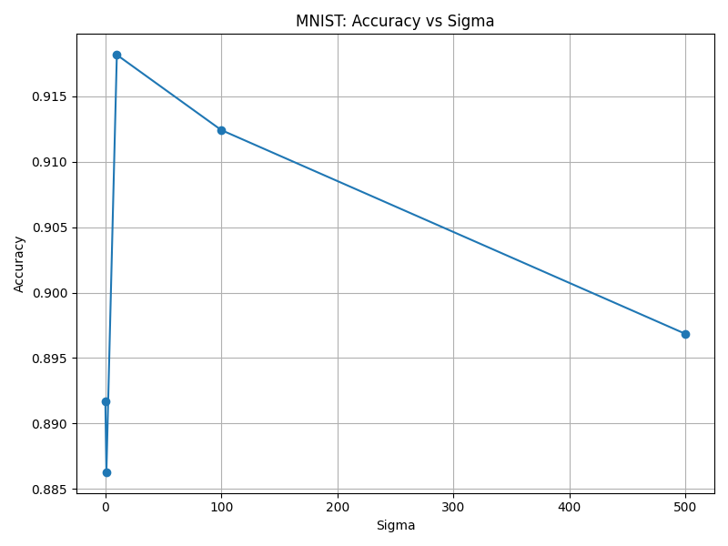

Weston Mansier (wlm35) Individual Report

# Survey
The papers I read investigated different methods and applications of semi-supervised learning using graph-based structures. The methods build a graph that uses the examples (both the labeled and unlabeled examples) as nodes, and the edges that connect the nodes represent the similarity between the nodes. These models are often "transductive," meaning the models only operate on the labeled and unlabeled data provided. These learning methods do not generalize to unseen data not included in the training set. I will go in to more detail on this in the methods and results sections.

## Semi-Supervised Learning Using Gaussian Fields and Harmonic Functions
Zhu et al. (2003) presents a novel approach to graph based semi-supervised learning, which leverages both labeled and unlabeled examples by representing them in a weighted graph structure and applying principles of harmonic functions and random field theory. The foundation of this approach lies in representing data points as vertices in a weighted graph $G = (V,E)$, where $V$ corresponds to both labeled and unlabeled points. The edges $E$ are weighted according to the similarity between instances, typically using a Gaussian kernel function:

$W_{i,j} = exp(-\sum_{d-1}^{m}{\frac{(x_{id} - x_{jd})^2}{\sigma^2_d}})$

where ${x_{id}}$ represents the d-th component of instance ${x_i}$, and $\sigma_d$ is a length scale hyperparameter for each dimension. This weighting scheme ensure that nearby points in Euclidean space receive larger weights, encoding the assumption that similar instances should have similar labels.

The learning problem of this method is formulated using a Gaussian random field defined on this graph $G$. The key insight is to find a real-valued function $f$ that maps vertices to labels while minimizing the quadratic energy function:

$E(f) = \frac{1}{2}\sum_{i,j}w_{ij}(f(i)-f(j))^2$

This energy function embodies the smoothness assumption, which is a common assumption for all graph based models. The smoothness assumption is that the function should vary smoothly over the graph structure. The solution is constrained to match the known labels on the labeled vertices while satisfying the harmonic property ($\Delta f=0$).

The harmonic property leads to a key characteristic of the solution: the value at each unlabeled point must equal the weighted average of its neighbors:

$f(j) = \frac{1}{d_j}\sum_{i~j}w_{ij}f(i)$

where $d_i = \sum_{j}w_{ij}$ is the degree of vertex $i$. This property yields an effective solution that can be computed using matrix operations:

$f_u = (D_{uu} - W_{uu})^{-1}W_{ul}f_{l}$

where $f_u$ denotes the values on the unlabeled data points, $D$ is the diagonal matrix with entries $d_i=\sum_jw_{ij}$ and W is the weight matrix. The subscripts indicate labeled ($l$) and unlabeled ($u$) blocks of the matrices.

The methods described in this paper have deep connection to many other theoretical frameworks. These include:

1. Random Walks: The solution $f(i)$ can be interpreted as the probability that a random walk start at vertex $i$ hits a positive labeled vertex before a negative one.

2. Electrical Networks: The problem is equivalent to solving for voltages in an electric network where labeled points are held at fixed voltages.

3. Spectral Graph Theory: The solution relates to the spectrum of the graph Laplacian, connecting to spectral clustering methods.

This method's ability to naturally incorporate unlabeled data through graph structure makes it particularly valuable for real-world applications, where labeled data is scarce and difficult to obtain. The strong theoretical foundations and conncetions to multiple other frameworks provides both insights to its success and avenues for further development.

## Learning from Labeled and Unlabeled Data using Graph Mincuts
Blum and Chawla (2003) present an approach that transforms the semi-supervised learning problem into a graph mincut problem. Their key innovation is representing both labeled and unlabeled examples as vertices in a weighted graph and finding an optimal labeling by computing minimum cuts.

The approach constructs a graph $G=(V,E)$ where V includes all labeled and unlabeled examples, as well as two special classification vertices, $v_-$ and $v_+$. Here the edge weights are labeled as being infinite between $v_+$ and positive labeled examples; infinite between $v_-$ and negative labeled examples; and weighted edges between examples based on similarity measures.

The graph mincut problem then aims to find the minimum weight set of edges whose removal disconnects the start node ($v_+$) from the sink node ($v_-$). This cut is found using a max flow algorithm from $v_+$ to $v_-$, and uses the edge weights as the capacities.

The removal of the edges in the cut partitions the vertices into two sets, $V_+$ and $V_-$. The algorithm then assigns a positive label to all unlabeled examples in $V_+$, and a negative label to all unlabeled points in $V_-$.

## Semi-Supervised Learning with Trees
Kemp et al. (2003) present an approach to semi-supervised learning that uses the labeled and unlabeled data by organizing exampels into a tree structure based on their similarity. The key insight here is treating labels as mutations that spread along the branches of this tree - labels are more likely to stay the same between nearby points on the tree than between distant points. This allows the algorithm to make predictions about unlabeled examples by examining their position in the tree relative to the labeled examples and computing how likely different labeles are to have "mutated" to reach each unlabeled point.

The model assumes a binary classification problem with a feature matrix X containing all examples. L is the set of labeled examples with observed labels $Y_{obs}$. U is the set of unlabeled examples. The goal is to infer labels $Y$ for unlabeled examples by marginalizing over possible trees $T$:

$p(y_i=1 | Y_{obs}, X) = \sum_T(y_i=1|Y_{obs},T)p(T|Y_{obs}, X)$

The label inference for a specific tree decomposes as:

$p(y_i=1 | Y_{obs}, T) = \frac{\sum_Yp(y_i=1|Y)p(Y_{obs}|Y)p(Y|T)}{\sum_Yp(Y_{obs}|Y)p(Y|T)}$

Often, assumptions abotu the sampling and noise are made that similifies this equation. Specifically, the assumptions made are that the labeled objects were chosen at random from the domain, and that there is no noise present in the object. This gives us that P Given these assumptions are true, the previous equation simplifies to

$p(y_i=1|Y_{obs}, T) = \frac{\sum_{Y consistent with Y_{obs}:y_i=1} p(Y|T)}{\sum_{Y consistent with Y_{obs}} p(Y|T)}$

The model defines a mutation process that determines how labels spread through the tree using a continuous-time Markov chain with parameter $\lambda$. The mutation is defined by the matrix:

$Q = \begin{bmatrix} -\lambda & \lambda \\ \lambda & -\lambda \end{bmatrix}$

This gives transition probabilities along a branch of length t:

$e^{Qt} = \begin{bmatrix} \frac{1+e^{-2\lambda t}}{2} & \frac{1-e^{-2\lambda t}}{2} \\ \frac{1-e^{-2\lambda t}}{2} & \frac{1+e^{-2\lambda t}}{2} \end{bmatrix}$

# Methods
## Harmonic Energy Minimization Algorithm
The first algorithm I implemented is the harmonic energy minimization algorithm described in the Zhu et al. (2003) paper. I made slight modification to the algorithm to be able to accept both numerical and categorical data, but the rest of the implementation follows the outline of the Zhu et al. paper.

The algorithm first constructs a similarity graph represented by a matrix W that captures relationships between points. For numeric features, similarities are computed using the RBF kernel (as described in the paper):

$W_{num_{ij}} = exp(-\frac{||x_i - x_j||^2}{2\sigma^2})$

For categorical features, similarities are based on the Hamming distance:

$W_{cat_{ij}} = 1 - d_{hamming}(x_i, x_j)$

These matrices are then combined into a single matrix $W$. The graph is then sparsified by retaining only the k nearest neighbors for each point, and made symmetric by taking the max of $W$ and $W^T$. From this similarity matrix, we compute the degree matrix D (which is a diagonal matrix with entries $D_{ii} = \sum_j W_{ij}$) and the graph Laplacian $L = D - W$.

The core labele propagation is performed by partitioning the Laplacian into labeled and unlabeled components, adn then using those to solve the harmonic equation: 

$f_u = -L_{uu}^{-1}L_{ul}f_l$

Where $f_u$ represents the labels for unlabeled points and $f_l$ contains the known labels. This equation minimizees the energy function while respecting the labeled examples as constraints. 

The final prediction for each unlabeled point is obtained either as class probabilities (the raw values of $f$) or as discrete class assignments (by taking argmax over the probabilities). 

The algorithm accepts parameters including $\sigma$, which controls the width of the Gaussian/RBF kernel that is used to compute similarities between numerical featuers in the data. A larger value of $\sigma$ means that points can be farther apart in feature space while still being considered similar - the similarity decays more slowly with distance. Conversely, a smaller $\sigma$ means the similarity drops off more quickly with distance, so only very close points will be considered similar. This makes $\sigma$ a crucial parameter that effectively controls the neighborhood size when building the similarity graph.

## Mincut Algorithm
In addition to the harmonic energy minimization algortihm, I attempted to implement the graph mincut algorithm described by Blum and Chawla (2001). While I was unable to get this algorithm properly working, I will include details on my implementation and will provide insight into why I believe my algorithm was acting the way it was.

The algorithm takes in both numeric and categorical features, and uses them to construct a weighted directed graph $G=(V,E)$ where $V$ contains all labeled and unlabeled vertices as well as the start and sink nodes.The similarities are computed the same here as the are in the harmonic energy minimization function, combining to form a single weight matrix W which stores the weights between all the examples.

The algortihm then adds edges to the graph between labeled examples and the corresponding start or sink node (positive examples gain an edge with the start node, negative examples gain an edge with the sink node). It then creates a weighted edge between examples, where $w(x_i, x_j) = w(x_j, x_i) = W_{ij}$. In attempts to get the algorithm to properly separate classes, i attempted to add a balancing term b, where $b=r(1-r)$, where r is the expected positive class ratio. The idea behind this balance term was that it would prevent extreme partitions where all points are assigned to a single class. This aims to make cuts through the similarity graph that finds more balanced partitions rather than trivially cutting all edges to one terminal vertex. However, the balance term did not work in practice.

Once the graph has been formed, the algorithm computes the minimum s-t cut, separting the examples into two sets: S, which is the source set, and T, which is the sink set. S contains the source vertex and all vertices reachable from it after the cut. T contains the sink vertex and all remaining vertices. The algorithm implements NetworkX's minimum_cut function, which uses the Ford Fulkerson (maximum flow) algorithm to find the cut. The algorithm repeatedly finds augmented paths through the residual graph until no more paths exist. The minimum cut corresponds to the edges that are staturated in the maximum flow. 

# Research
## Implemented: Dynamic Weight Updates to Harmonic Minimization Algorithm
My research extension, which I added to the harmonic minimzation algorithm code, implements dynamic weight updates to the standard harmonic function minimization algorithm by iteratively updating the similarity matrix W based on current label predictions.

The key idea behind this extension is that as the algorithm makes predictions about unlabeled points, we can use these predictions to refine our notion of similarity between points. The intuition is that if two points are predicted to be in the same class, we might want to increase their similarity weight, while if they're predicted to be in different classes, we might want to reduce their similarity weight.

Specifically, the implementation creates an agreement matrix where entries are 1 if two points $i$ and $j$ are predicted to be in the same class, and 0.5 if points $i$ and $j$ are predicted to be in different classes. It then multiplies the original similarity matrix with this agreement matrix, renormalizes the weights and ensures weight matrix symmetry, and then recomputes the graph Laplacian with the updated weights. Using the new Laplcian, it solves the harmonic function equation, and repeats this process until convergence.

I believed this research extension to be worth investing and implementing as the static nature of the standard algorithm's similarity scores seemed to omit important information about the data that could be revealed. The fixed similarities between points was based only on features, but actual class relationships might not perfectly align with feature-based similarity. Using predicted labels to update similarities provides a form of self-training, potentially allowing the algorithm to discover and reinforce natural class boundaries. The dynamic updates could help correct initial similarity estimates that might be misleading due to the curse of dimensionality or noise in the feature space (which is often assumed to not exist in these types of algorithms, but could certainly still be present).

## Considered: Multiple Similarity Metrics
As a potential research extension to the original harmonic minimization algorihtm, I considered incorportating multiple similarity metrics into the harmonic minimization framework. The motivation behind this would be to capture different notions of similarity that may be relevant for the specific classification task at hand. For example, in addition to the Gaussian kernel based on Euclidean distance, on could also consider domain-specific similarity metrics tailored to the data type. Alternatively, the similarity metric could be learned from the data, allowing the algorithm to adapt the similarity measure to better capture the underlying data structure and class boundaries.

Implementation of this extension would involve extending the graph construction step to support multiple similarity metrics, modifying the harmonic minimization objective function, and investigating methods for learning the relative weights of the different similarity metrics. This extension has the potential to improve classification accuracy, enhance the flexibility and adaptability of the algorithm, and provide valuable insights into feature importance for a given classification task.

## Considered: Mincut + Harmonic Hybrid
I also considered implementing a research extension that would have combined the strengths of the mincut and harmonic minimization algorithsms. The hybrid approach would start by using the mincut algorithm to obtain an initial set of "hard" labels for the unlabeled data points. The mincut algorithm frames the semi-supervised learning problem as finding a minimum cut in a weighted graph, which allows us to quickly provide a course initial labeling f the unlabeled examples.

However, the mincut labeling might not fully capture the underlying data structure that the harmonic minimization approach is designed to exploit. Therefore, the hybrid approach would then take these initial mincut labels and use them as constraints in the harmonic minimization framework. Specifically, the harmonic minimization step would compute "soft" probabilistic labels for the unlabeled data, leveraging the graph structure to produce more nuanced predictions compared to the hard mincut labels.

Finally, the hybrid approach would combine the hard mincut labels and the soft harmonic minimization probabilities using some weighting scheme. This allows the method to take advantage of the strengths of both techniques. The specific details of how to optimally combine the mincut and harmonic minimization predictions would require implementation and extensive experimentation. Some potental approaches could include using the mincut labels as priors for the harmonic minimization, or using the harmonic probabilities to smooth and refine the mincut hard labels. Additionally, the weighting applied when blending the two sets of predictions could be learned from data or set based on principles such as entropy minimization.

# Results, Analysis, and Discussion
In all experiments listed below, the accuracy reported represents the accuracy of the predictions on the unlabeled examples. Since the algorithm I implemented is transductive, all available data points are included in training (these methods are not designed to be used on unseen data). I then collected the predictions of all the unlabeled examples and compared them to the true label, and reported the accuracy of these predictions only on the unlabeled examples.

## Australian Credit Card Data
The Australian Credit Approval dataset is a well-known dataset in teh field of credit risk assessment and binary classification. It contains 690 instances, each representing a credit card application, with 14 attributes that describe various characteristics of the applicant, such as their credit history, employment status , and personal details. The dataset contains a mixture of numeric and categorical features, making it suitable for evaluating machine learning algorithms that can handle both types of data. The target variable is a binary outcome indicating whether a credit card application is approved or rejected, providing a clear objective for classification tasks.

I conducted experiments to find the the optimal hyperparameters and split size for the Australian credit approval dataset, the goal being to evealuate the impact of various hyperparameters on the algorithm's accuracy and investigate the relationship between the size of the labeled data and the model's performance.

The experiments were carried out by first loading in the data and then standardizing the numeric features. The paper often cites a 10% labeled data size, so for the hyperparameter tuning I will use that as the baseline split size. A grid search was then performed to find the optimal hyperparameters for the algorithm. The hyperparameters tuned included sigma which represents the similarity kernel width, and is the most important for this dataset. The hyperparameter combinations were evaluated and the accuracy on the unlabeled data was calculated for each combination.

Once I collected the best set of hyperparameters, which included a sigma value of 25, I used them to see how the proportion of labeled data effects the accuracy of the dataset. The split sizes ranged from 0.1 to 0.9, representing the proportion of data uses as unlabeled data points.

I then repeated those two experiments, but this time I set the dynamic_weights parameter to True. This applies my research extension (dynamic weight updates) to the austrlian credit approval dataset. Below are the results. The dynamic weight updates also contribute to increasing the overall runtime of the algorithm, so the tuning process takes longer, even on a relatively small dataset like the Australian credit approval dataset.

The interesting takeway from these plots is how the algorithm (both with weight updates and without) performs as the split size changes. Neither graph shows a consistent change in the accuracy as test size changes, and the original algorithm has an unusual peak in accuracy when 40% of the examples start as unlabeled (most of the tests show that performance decreases as test size increases, which is what one would expect as larger labeled sets give us more information to be able to group unlabeled points to labeled ones). 

The fact that the extension algorithm doesn't show the same peak (though it does increase when the unlabeled set size is 40%) suggests that adapting the weights based on predictions might be smoothing out some of the naturally present patters, potentially oversimplifying the relationships between the features. It is also worth noting that the dynamic weight updates result in much worse accuracy when the labeled set size is only 10%. This reveals an important insight into how the dynamic weight algorithm works (and why it might not be improving performance). I believe that the dynamic weight updates are amplifying errors made early on in the process. Misclassifications made on any of the 90% of unlabeled points can lead to incorrect weight assumptions that impact the subsequent predictions, potentially creating many errors in a row that propagates through the large unlabeled portion of the dataset.

## King-Rook vs King Pawn Data
The King-Rook vs King-Pawn (kr-vs-kp) dataset is a well-known dataset from the UCI Machine Learning Repository for classification tasks. It is derived from chess endgames, where the goal is to determine whether the player with the King and Rook can force a win against the opponent with the King and Pawn under optimal play. The dataset consists of 36 categorical features representing the chessboard state, such as piece positions and other conditions. There are a total of 3,196 instances, each labeled as either win or a non-win for the King-Rook player.

For the chess dataset, since all the variables are categeorical, the sigma parameter does not need to be tuned (the sigma is used in the RBF kernel for calculating similarity with numerical variables). Therefore, the experiments I ran on this dataset were to see how accuracy changes as the split size changes. I did this with the original algorithm and then with the dynamic weights extension for comparison.

With both the original algorithm and the research extension, the accuracy peaks in the mid-90%s for a test size of 0.3 (meaning 30% of the examples were unlabeled). As the size of the unlabeled sample decreases the accuracy has a very steep dropoff, which isn't necessarily the case for the Australian dataset (more on that later). Generally, the algorithm performs well on the chess dataset, which makes sense. Chess is a very positional game. The more similar two positions, the more likely the outcome is going to be the same. This makes chess positions a very strong fit for our algorithm, which bases its predictions on the similarity of examples.

The algorithm does a good job of capturing these positional relationships, due to the way it constructs the similarity matrix (using k-nearest neighbors approach to ensure that ecah position is connected to other positions with similar structures). Additionally, chess positions in endgames often have clear, definitive evaluations, and become even more definitive when less pieces are on the board (and therefore there is more certainty about the position). 

The research extension performs worse than the original algorithm here, and I believe that has to do with the strength of the original similarity matrix. The changes that occur from the research extension disrupt the underlying behaviors and structure of the positional dataset, resulting in worse performance. The section "Overall Analysis" contains more information on why I believe the research extension fails to improve the original algortihm.

## MNIST Data
The original paper ran many experiments on image classification data. I intended to do this as well, but ran into issues regarding my available computational resources. Since the algorithm stores a similarity matrix of size $nxn$, where $n$ is the number of samples, it becomes infeasible very quickly. The MNIST image classification dataset, which contains 70,000 examples, simply did not run. After a while of running on the full dataset, I would receive an error stating that my device could not store the needed matrix. After attempting this on multiple devices all of differing specs, I determined that I wouldn't able to replicate their work on the MNIST dataset.

However, I still wanted to do some testing on the MNIST dataset. Therfore, the following experiments were run on a random sample (with even class distributions) from the original MNIST dataset. For computational purposes, I only pulled 6000 examples for these experiments. When doing hyperparameter tuning, I will be using a smaller grid to avoid running the algorithm too many times and for too long. 

The MNIST dataset is a widely used benchmark in machine learning, consisting of 70,000 images of handwritten digits from 0 to 9. Each image is in grayscale, is 28x28 pixels in size, and is labeled with the corresponding digit. Its simplicity and well-structured nature make MNIST an excellent starting point for testing new machine learning models, while still presenting challenges in recognizing varying handwriting styles and noise.

It is worth emphasizing again that my computational limitations and need to perform analysis on a subset of the MNIST dataset must be considered when analyzing the results. Zhu et al reported best results using $\sigma = 380$. I expanded my sigma test values to account for this, but my results did not match that of the paper. Both the original algorithm and the extension had the best accuracy when sigma was 10, which is significantly smaller than the reported 380. In individual trials I ran where I incorporated larger portions of the MNIST dataset, the accuracy did show an improvement as sigma increased to be very large. However, these experiments took extremely long and frequently caused my system to crash.

The general trend of my accuracy plots as split size changes is in line with the experimental results from the Zhu paper. As the size of the labeled set increases, the accuracy of both of my algorithms also increased. The performance of both of my algorithms is worse compared to the paper, but this is liked due to the fact that I have a smaller sample of labeled examples to build off of.

## Overall Analysis
For all the datasets I tested on, my research extension did not improve performance. There are multiple elements that I believe could have led to this being the case. Firstly, I believe my extension is possibly too rigid. The current approach I implemented for updating weights uses a simple binary scheme. Weights are either strengthened (1.0) for nodes with matching predictions or weaked (0.5) for those that differ. This might be too rigid of an approach to capture more nuanced relationships between data points, especially in datasets with clear structural patterns like the chess endgames.

Additionally, it is possible that the weight updates could disrupt the initial similarity graphs, which are carefully constructed based on the feature similarity of the examples. The initial similarities are calculated using complex and intricate distance metrics (calculating using RBF kernels for numerical features and Hamming distance for categorical features). These capture the underlying structure of the data pretty well, which is then distrupted when we modify the weights based on preliminary predictions. 

# Bibliography
Blum, A., & Chawla, S. (2001). *Learning from labeled and unlabeled data using graph mincuts.* Proc. 18th International Conf. on Machine Learning.

Chapelle, O., Weston, J., & Scholkopf, B. (2002). *Cluster kernels for semi-supervised learning.* Advances in Neural Information Processing Systems, 15.

Kemp, C., Griffiths, T., Stromsten, S., & Tenenbaum, J. (2003). *Semi-supervised learning with trees.* Advances in Neural Information Processing System 16

Quinlan, R. (1986). Thyroid Disease [Dataset]. UCI Machine Learning Repository. https://doi.org/10.24432/C5D010.

Quinlan, R. (1987). Statlog (Australian Credit Approval) [Dataset]. UCI Machine Learning Repository. https://doi.org/10.24432/C59012.

Shapiro, A. (1983). Chess (King-Rook vs. King-Pawn) [Dataset]. UCI Machine Learning Repository. https://doi.org/10.24432/C5DK5C.

Zhu, X. (2005). *Semi-Sumervised Learning with graphs.* Doctoral dissertation, Carnegie Mellon University. CMU-LTI-05-192.

Zhu, X., Ghahramani, Z., & Lafferty, J. (2003). *Semi-supervised learning using Gaussian fields and harmonic functions.* The 20th International Conference on Machine Learning (ICML).